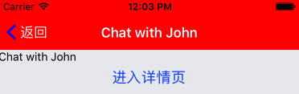
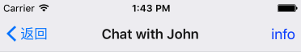
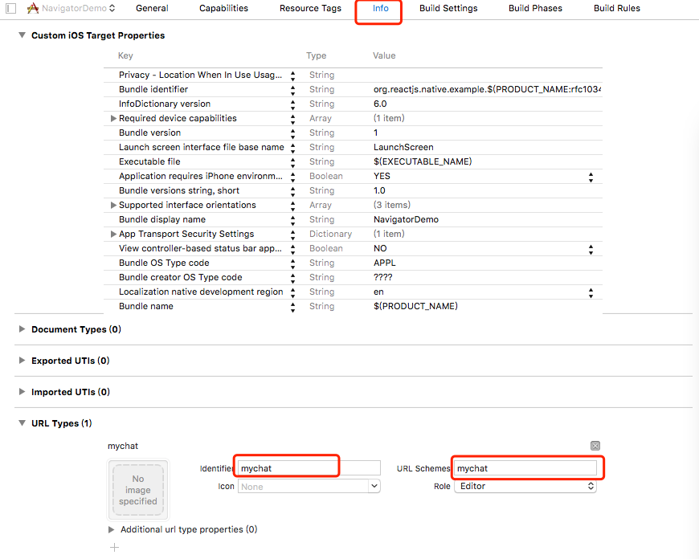

# react-navigation 导航系统的使用

## react-navigation的安装

```shell
npm install --save react-navigation
```

或

```shell
yarn add react-navigation
```

## react-navigation的使用

### StatusBar

这是控制应用状态栏的控件，我们可以通过`hidden`属性来控制是否显示状态栏，同时也可以通过`barStyle`来设置状态栏文本的颜色(目前只支持'default'、'light-content'、'dark-content')，另外我们可以设置`backgroundColor`属性来改变状态栏的背景色(但此属性只在安卓设备上有效)。例如：

```html
<StatusBar backgroundColor="blue" barStyle="dark-content" /> 
```

### StackNavigator 导航栏

`StackNavigator`就是屏幕上方的导航栏，提供了屏幕之间的转换的方式。

例如：

```jsx
export default function HomePage(props) {
    const {navigate} = props.navigation;
        return (
      <View>
        <Text>Hello, Navigation!</Text>
        <Button
          onPress={() => navigate('Chat')}  //点击按钮导航到ChatPage
          title="Chat with Lucy"
        />
      </View>
    );
}

HomePage.navigationOptions = {
    title: 'HomePage'
}
export default function ChatPage(props) {
    const {navigate} = props.navigation;
        return (
      <View>
        <Text>Chat with Lucy!</Text>
        <Button
          onPress={() => navigate.goBack()}  //点击按钮时回调goBack方法返回上一个页面
          title="return HomePage"
        />
      </View>
    );
}
        
const App = StackNavigator({
  Home: { screen: HomePage },
  Chat: { screen: ChatPage }
});
```

对于`StackNavigator`我们可以通过`navigationOptions`的`headerStyle`属性自定义其样式,包括背景色，高度等；通过`headerTintColor`自定义导航栏的颜色，包括图标和标题; 另外还可以通过`headerBackTitleStyle`、`headerTitleStyle`分别自定义左侧返回键文字和导航栏标题颜色; 通过`title`属性自定义导航栏的标题，另外需要注意的是`headerBackTitle`属性是对下一个场景起作用，拿上面的例子来说，如果我们希望ChatPage的返回键标题为`返回`，则需要给HomePage设置`headerBackTitle`属性。

例如：

```jsx
ChatPage.navigationOptions = {
  title: 'Chat with John',
  headerStyle: {
      backgroundColor: 'red',
    },
    headerTintColor: 'blue',  //自定义导航栏颜色
    headerBackTitleStyle: {  // 自定义左侧返回键文本的颜色
      color: 'white'
    },
    headerTitleStyle: {  //自定义标题的颜色
      color: 'white'
    }
}
```

显示结果如下：



除了上述提到的属性，我们可以通过`headerLeft`、 `headerRight`分别添加导航栏左、右两侧添加内容，可以是按钮，图标等。下面的代码是在导航栏右侧添加一个按钮：

```jsx
ChatPage.navigationOptions = {
  title: 'Chat with John',
  headerRight: (
      <Button title='Info' />
    ),
}
```

显示结果如下：



### 如何将一个新页面加入导航系统？

为了方便导航系统的管理，我们可以在项目中添加一个`App.js`文件，然后将页面组件引入到`App.js`文件中，然后通过下面的方式将其加入导航系统：

```jsx
import { StackNavigator } from 'react-navigation';
import HomePage from './homePage/HomePage';
import ChatPage from './chatPage/ChatPage';
import DetailPage from './detailPage/DetailPage';

export default App = StackNavigator({
  Home: { screen: HomePage},
  Chat: { screen: ChatPage},
  Detail: {screen: DetailPage}
});
```

### Deep Linking

设想我们现在想要使用类似`mychat://chat/John`的URL来打开我们的App,并直接进入到John的ChatPage,我们需要进行以下几项配置：

* 首先，我们需要将`HomePage`、`ChatPage`、`App.js`进行重构

  `HomePage.js`

  ```jsx
  import React, {Component} from 'react';
  import {View, Text, Button} from 'react-native';

  export default function HomePage(props) {
      const {navigate} = props.navigation;
          return (
        <View>
          <Text>Hello, Navigation!</Text>
          <Button
            onPress={() => navigate("Chat", { user: "John" })}
            title="Chat with people"
          />
        </View>
      );
  }

  HomePage.navigationOptions = {
      title: 'HomePage',
  }
  ```

  `ChatPage.js`

  ```jsx
  import React, { Component } from "react";
  import { View, Text, Button, StatusBar } from "react-native";

  export default function ChatPage(props) {
    const { params } = props.navigation.state;
    return (
      <View>
        <StatusBar backgroundColor="blue" barStyle="dark-content" />
        <Text>Chat with {params.user}</Text>
        <Button onPress={() => props.navigation.navigate('Detail')} title="进入详情页"></Button>
      </View>
    );
  }
  ChatPage.navigationOptions = ({ navigation }) => {
    const { state, setParams } = navigation;
    const isInfo = state.params.mode === "info";
    const { user } = state.params;
    return {
      title: isInfo ? `${user}'s Contact Info` : `Chat with ${user}`,
      headerRight: (
        <Button
          title={isInfo ? "Done" : `${user}'s Info`}
          onPress={() => setParams({ mode: isInfo ? "none" : "info" })}
        />
      ),
    };
  };
  ```

  `App.js`

  ```jsx
  import { StackNavigator } from "react-navigation";
  import HomePage from "./homePage/HomePage";
  import ChatPage from "./chatPage/ChatPage";
  import DetailPage from "./detailPage/DetailPage";

  export default (App = StackNavigator({
    Home: { screen: HomePage },
    Chat: { screen: ChatPage, path: "chat/:user" }, //path告诉router需要匹配的path和需要提取的参数
    Detail: { screen: DetailPage }
  }));
  ```

* 设置URL前缀

  `App.js`

  ```jsx
  import React from 'react';
  import {Platform} from 'react-native';
  import { StackNavigator } from "react-navigation";
  import HomePage from "./homePage/HomePage";
  import ChatPage from "./chatPage/ChatPage";
  import DetailPage from "./detailPage/DetailPage";

  const MainApp = StackNavigator({
    Home: { screen: HomePage },
    Chat: { screen: ChatPage, path: "chat/:user" }, //path告诉router需要匹配的path和需要提取的参数
    Detail: { screen: DetailPage }
  });
  //安卓的URL前缀应包括host
  const prefix = Platform.OS == 'android' ? 'mychat://mychat/' : 'mychat://';

  export default App = () => <MainApp uriPrefix={prefix}></MainApp>
  ```

* iOS配置

  * 在`NavigatorDemo/ios/NavigatorDemo/AppleDelegate.m`中添加以下内容

    ```jsx
    //添加在文件顶部
    #import <React/RCTLinkingManager.h>

    //添加在@end上方
    - (BOOL)application:(UIApplication *)application openURL:(NSURL *)url
      sourceApplication:(NSString *)sourceApplication annotation:(id)annotation
    {
      return [RCTLinkingManager application:application openURL:url
                          sourceApplication:sourceApplication annotation:annotation];
    }
    ```

  * 在Xcode里,打开项目的`NavigatorDemo/ios/NavigatorDemo.xcodeproj`.在边栏中选择项目导航到info tab.向下滑动到“URL Types”并且添加一个.在新的URL type,设定名称和url图标对应想导航到的url图标.如下图：

    

  * 重新运行App

    ```shell
    react-native run-ios
    ```

  * 打开Safari浏览器，输入`mychat://chat/John`可以直接打开App,并跳转到John的ChatPage

* Android配置

  为了在Andorid中链接外链,可以在manifest中创建一个新的intent.
  在`NavigatorDemo/android/app/src/main/AndroidManifest.xml`中`MainActivity`内添加新的`VIEW`type`intent-filter`.

  ```
   <intent-filter>
      <action android:name="android.intent.action.VIEW" />
      <category android:name="android.intent.category.DEFAULT" />
      <category android:name="android.intent.category.BROWSABLE" />
      <data android:scheme="mychat"
            android:host="mychat" />
  </intent-filter>
  ```

  现在,重新运行:

  ```
   react-native run-android
  ```

  在Android中测试intent操作,运行

  ```
   adb shell am start -W -a android.intent.action.VIEW -d "mychat://mychat/chat/John" com.navigatordemo
  ```

